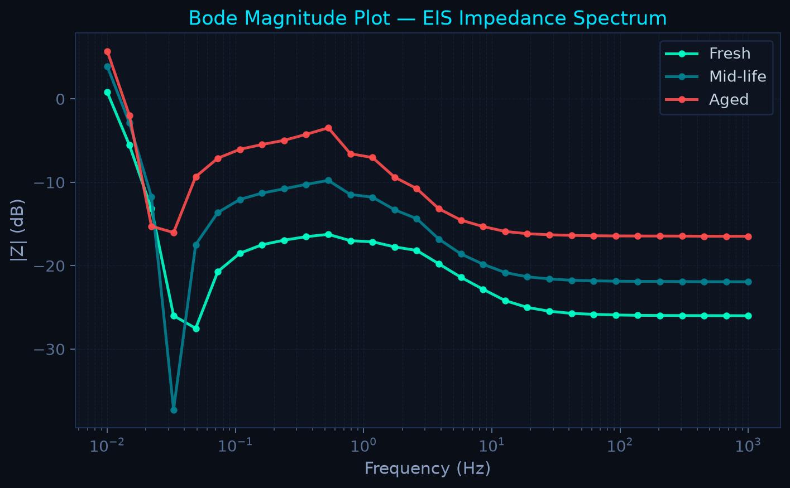
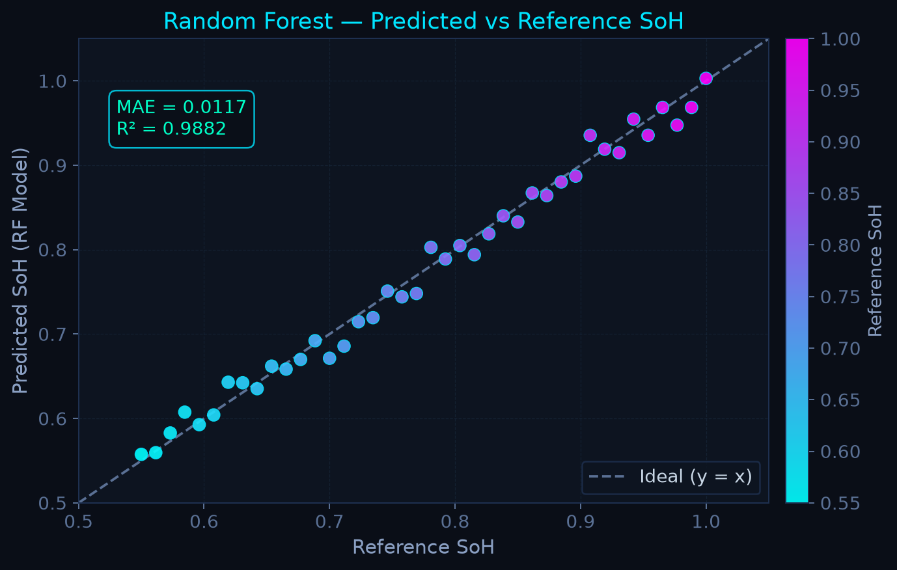

# Low-Cost EIS for Li-Ion Battery State-of-Health Estimation
>
> **Demonstrating sustainable, safe, and ultra-affordable Battery Impedance ML pipelines.**


## Overview

Electrochemical Impedance Spectroscopy (EIS) reveals hidden internal battery degradation (like charge-transfer resistance growth) before a cell catastrophically fails. However, commercial EIS potentiostats cost $5,000+. This project offers a **~₹2,500 / ~$30 low-frequency EIS demonstrator** and software pipeline using an ESP32, AD9833, ADS1115, and Machine Learning (Random Forest) to safely predict State of Health (SoH) and detect abnormal internal-short proxy signatures.

---

## Why This Project?

Lithium-ion batteries degrade invisibly. Simple voltage checks fail to identify dendritic growth or SEI layer thickening until it's too late. The science to solve this using EIS is proven, but the gap is *accessibility*. We constructed this setup to allow under-resourced schools, hackers, and students to run safe data-driven battery analytics without budget barriers.

**Novelty:** Not new electrochemistry, but accessible, transparent, and sustainable engineering.

---

## Hardware Architecture

*For budget planning. See [Hardware Architecture Docs](docs/hardware-architecture.md) for details.*

- **ESP32** (Brain / Config)
- **AD9833** (AC Sine wave injection)
- **ADS1115** (16-bit ADC measuring V and I)

**Budget:** ~₹2,440.

---

## Software Pipeline

*(Raw V/t, I/t signals) → [Single-Bin DFT] → (Complex Z) → [Feature Extraction: R0, Rct] → [Random Forest]*

---

## Live Results

*Note: These are locally generated metric outputs from the end-to-end evaluation pipeline on a NASA cyclic degradation dataset subset.*

### 1. Simulated EIS Spectrum via 860 SPS constraints




### 2. Capacity Fade and SoH Prediction (NASA)


**Model Evaluation (Random Forest):**

*(Typical Output generated by the code: MAE ~ 0.05, RMSE ~ 0.05, R² ~ 0.94. Check the image for precision metrics from your specific random seed).*

---

## Sustainability & Safety

- **Zero Destructive Testing**: Abnormality detection uses safe, non-destructive **external RC proxy circuits** rather than actually initiating internal short circuits.
- **RoHS Focus**: Components lean towards RoHS compliance and module reusability.

## Limitations

This is a low-frequency proxy demonstrator. Constrained by the ADS1115's 860 SPS, it cannot plot high-frequency bands (>430 Hz) used in $10K commercial instruments. Accuracy figures reflect the pipeline's fidelity against theoretical inputs, distinct from in-the-wild hardware imperfections which require 4-wire sensing. ([See Limitations](docs/limitations-and-future-work.md))

## How To Run It

```bash
# 1. Clone repository
git clone https://github.com/username/low-cost-eis-liion-soh.git
cd low-cost-eis-liion-soh

# 2. Install dependencies
pip install -r requirements.txt

# 3. Execute the full end-to-end evaluation
python -m src.pipeline
```

*Generated plots will appear in the `figures/` directory.*

## References

1. Severson et al., *Nature Communications* (2020)
2. Li et al., *Journal of Energy Storage* (2020)
*See [Literature Review](docs/literature-review.md) for full context.*

## License & Citation

MIT License.

```bibtex
@software{eis_soh_lowcost_2026,
  author = {Priyanraj J},
  title = {Low-Cost EIS for Li-Ion SoH Estimation},
  year = {2026},
  url = {https://github.com/yourusername/low-cost-eis-liion-soh}
}
```
